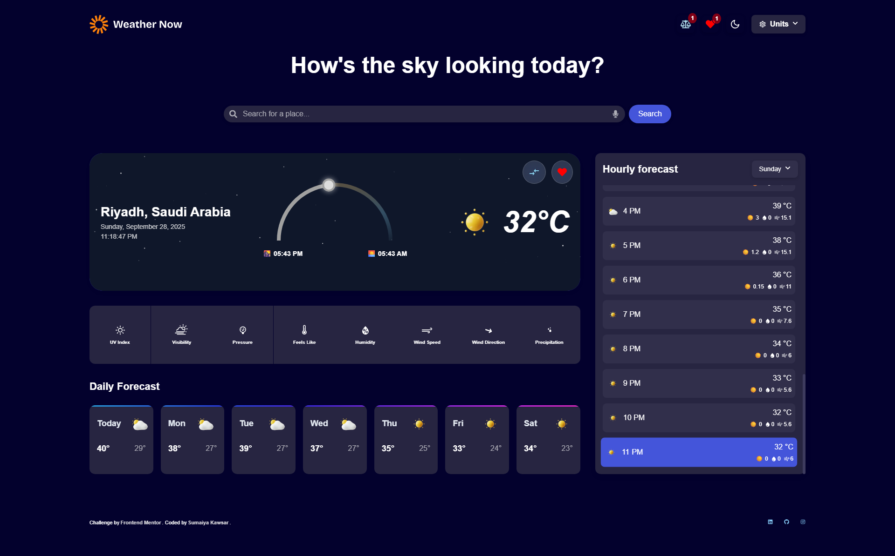

# Frontend Mentor - Weather app solution

 

  <h3>
    <a href="https://sumaiyakawsar.github.io/weather-app-challenge/">
      Demo
    </a>
     | 
    <a href="https://github.com/sumaiyakawsar/weather-app-challenge/">
      Solution
    </a>
     | 
    <a href="https://www.frontendmentor.io/challenges/weather-app-K1FhddVm49">
      Challenge
    </a>
  </h3>

 
 

## Table of contents

- [Frontend Mentor - Weather app solution](#frontend-mentor---weather-app-solution)
  - [Table of contents](#table-of-contents)
  - [Overview](#overview)
    - [✅ Features](#-features)
    - [📔Screenshot](#screenshot)
  - [My process](#my-process)
    - [⚙️ Built with](#️-built-with)
    - [👩🏻‍🎓 What I learned](#-what-i-learned)
    - [⚡ Challenges I faced \& Solutions](#-challenges-i-faced--solutions)
    - [🧩 My Process](#-my-process)
    - [Continued development](#continued-development)
    - [Useful resources](#useful-resources)
  - [Author](#author)

 
## Overview
This project is my submission for the FM30 Hackathon hosted by Frontend Mentor. The challenge was to build a Weather App using the Open-Meteo API. 

I focused on:
- I tried my best to build a clean, responsive UI with React and SCSS
- Going beyond the requirements with advanced features like voice search, PWA, compare locations, and more
 

 
### ✅ Features

Core Requirements:
- 🔍 Search weather by location
- 🌡️ View current weather: temperature, conditions, location, and extra metrics (feels like, humidity, wind, precipitation)
- 📅 Browse 7-day forecast with daily high/low temperatures and weather icons and hourly forecast with day selector
- ⚖️ Toggle between Imperial & Metric units (Celsius/Fahrenheit, km/h/mph, mm/inches)
- 📱 Responsive layout for all devices
- 🖱️ Hover & focus states for interactive elements

Extra features implemented:
- 📍 Geolocation detection (auto weather on first visit)
- ☀️ Sunrise/sunset times with visual indicators
- 🌈 Animated backgrounds based on weather conditions
- 🌗 Dark/Light themes that adapt to time of day
- 💾 Favorites/Saved locations system (localStorage)
- 🆚 Compare multiple locations side-by-side (localStorage)
- 🗣️ Voice search support
- ⏳ Skeleton loading states for better UX
- 🛰️ Additional metrics: UV index, visibility, air pressure
- 📲 PWA support for mobile installation

### 📔Screenshot

## My process

### ⚙️ Built with
- ⚛️ [React](https://reactjs.org/)
- 🎨 SCSS (mobile-first, responsive design)
- 📦 Flexbox & CSS Grid 
- ⏳ [react-loading-skeleton](https://github.com/dvtng/react-loading-skeleton#readme) - Used to display skeleton placeholders while content is loading, improving the user experience.
- 🎙️ [react-speech-recognition](https://github.com/JamesBrill/react-speech-recognition) - Provides voice input support, allowing users to search for locations or interact with the app using speech.
- 🚀 gh-pages - Enables quick and easy deployment of the React app to GitHub Pages.
- 🧹 [knip](https://knip.dev/) - Helps keep the codebase clean by detecting unused files, exports, and dependencies.
- 📦 Progressive Web App (PWA) setup with Vite

### 👩🏻‍🎓 What I learned
- Integrating multiple API data streams into React hooks
- Building scalable state management with custom hooks and context (compare, favorites, units, theming).
- Leveraging voice recognition and geolocation APIs.
- Adding keyboard support to improve accessibility.
- Improving UX with skeleton loading, subtle animations, and background changes tied to live data.
- How PWA integration with Vite works — and how small steps make a web app feel installable and native.
- The importance of a meaningful commit history to track progress (Maybe It wasnt perfect but I tried).
  
### ⚡ Challenges I faced & Solutions
- **Handling API responses**: I modularized API calls and used custom hooks for clean data fetching.
- **Compare Feature**: Synchronizing multiple locations side-by-side was tricky; I solved it with a useCompareList hook and context state management.(This feature was the most rewarding because it brought the app closer to how people actually compare weather.)
- **Voice Search**: Integrated speech recognition with natural UX, handling permissions, errors, and fallbacks for unsupported devices.  
- **Theming**: Previously I had only built light/dark themes, but this project required the theme to auto-adapt to time of day while still allowing manual switching — balancing UX and state logic.
- **Animated Backgrounds**: Iterated multiple times to make them responsive and driven by live weather data. (The thunder effect is my personal favorite.) 
- **Sunrise/Sunset Progress Indicator**: Implementing both sunrise-to-sunset and sunset-to-sunrise progress calculations was tricky. I had to handle dynamic times per location, adjust for time zones, and ensure the visual indicators accurately reflected the day/night progress throughout the 24-hour cycle. 
- I also relied on ChatGPT prompt iterations extensively — even after carefully crafting prompts — to solve edge cases and refine the features. (Mostly for Sunrise/Sunset Progress Indicator, Animated Backgrounds and Voice Search) 

### 🧩 My Process

**Planning & Setup**
- Defined the component structure (SearchBar, CurrentWeather, Forecasts, Compare, Favorites).
- Created custom hooks for geolocation, weather API calls, theme, and compare list.

**Core Features First**
- Implemented search, current weather, daily/hourly forecast.
- Set up responsive SCSS with a mobile-first approach.

**Enhancements**
- Added extra data (UV, air pressure, visibility).
- Integrated voice search and geolocation.
- Designed skeleton states for loading.

**Polish & Experience**
- Implemented dark/light theme switching tied to time of day.
- Added animated backgrounds for immersive UX.
- Created favorites and compare locations views.

**Final Step**
- Configured PWA so users can install it on mobile.
- Deployed to GitHub Pages with gh-pages.

### Continued development
- Add Toasts Later for Adding/Removing cities from comparelist & favourites. 
- AI powered insights

### Useful resources
- [PWC resource](https://dev.to/hamdankhan364/simplifying-progressive-web-app-pwa-development-with-vite-a-beginners-guide-38cf) - This is an amazing article which helped me finally understand PWC. I'd recommend it to anyone still learning this concept.
- [Voice search resource](https://www.youtube.com/watch?v=xJ_V55awyIo)
- [Skeleton resource](https://www.youtube.com/watch?v=g74Q0wRc6BQ&t=63s)
- ChatGPT & DeepSeek for brainstorming and debugging

## Author

<!-- - Website - [Add your name here](https://www.your-site.com) -->
 